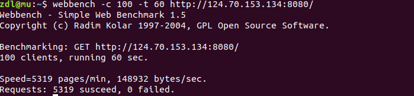
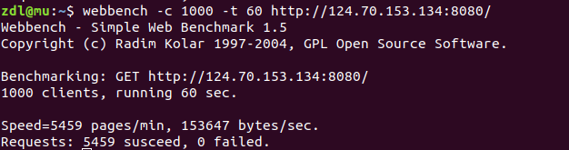
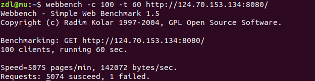
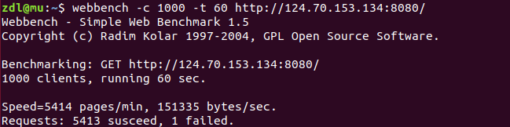

# 云端部署

## 部署

云服务器配置：**1核 2GB  CentOs 7.6 64bit**.

将webServer 部署在云服务器上，申请华为云弹性服务器，获取一个公网IP，作为服务器的IP地址。

1. 设置服务器的安全组规则，开放相关的出入方向的端口号，可以开发常用的端口号已备服务器之后使用。
2. 防火墙设置，添加例外端口。
3. 进入程序文件夹src
4. make
5. nohup  ./server      **后台运行  默认8080端口 线程池大小为4**

> nohup 意思是不挂断运行命令,当账户退出或终端关闭时,程序仍然运行
>
> 当用 nohup 命令执行作业时，缺省情况下该作业的所有输出被重定向到nohup.out的文件中，除非另外指定了输出文件。

## 压力测试

线程大小4

<<<<<<< HEAD

线程大小2

=======

线程大小2

>>>>>>> 3370da6272078b3135f4c8c692df722e95a33c4c

**由于云服务器的资源有限，只有1M的带宽，压力测试的效果远远低于本地测试。**

**线程池的初始化数量对并发量存在一定的影响，但并不是线程越多越好，需要结合系统资源而定。**
